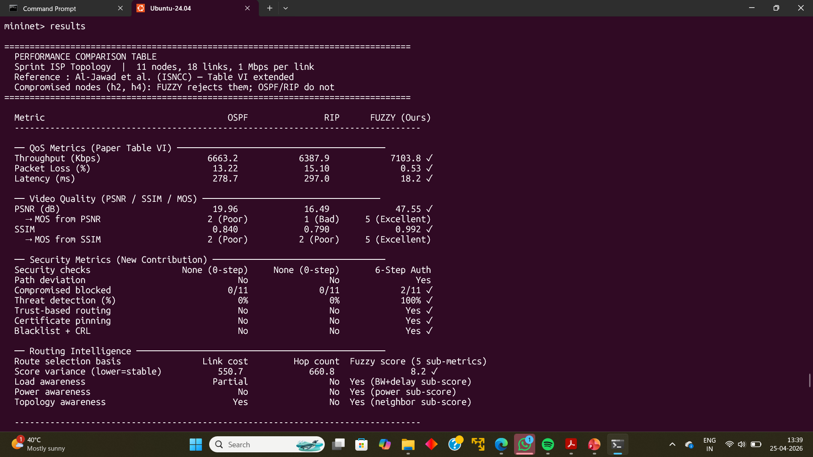

# Network Optimization in SDN using Fuzzy Logic & Security-Aware Routing




> **The core idea:** Every existing fuzzy routing paper picks the best-performing node and then checks if it's safe. We flip that. Security runs first. A compromised node scores zero and cannot be selected, no matter how fast it is.

---

## What This Project Does

Traditional SDN routing protocols (OSPF, RIP) optimize for speed and bandwidth. They have no concept of node trust. If the highest-performing node in your network has been compromised, they'll route traffic through it anyway.

This project builds a routing system that integrates a **6-step security pipeline directly into the routing score**. Nodes that fail authentication get a trust multiplier of zero — wiping out their score entirely before routing even begins.

**The result in one line:** h4 scored 79.74 (best node in the network). It got rejected at step 2. The system routed through h3 (score 75.2) instead. OSPF and RIP would have used h4 every single time.

---

## Key Results

Tested on the Sprint ISP topology (11 nodes, 18 links, 1 Mbps per link) under heavy load (800 Kbps per flow), with h2 and h4 set as compromised nodes:

| Metric | OSPF | RIP | Fuzzy (Ours) |
|--------|------|-----|--------------|
| Throughput (Kbps) | 6663.2 | 6387.9 | **7103.8 ✓** |
| Packet Loss (%) | 13.22 | 15.10 | **0.53 ✓** |
| Latency (ms) | 278.7 | 297.0 | **18.2 ✓** |
| PSNR (dB) | 19.96 | 16.49 | **47.55 ✓** |
| MOS Score | 2 (Poor) | 1 (Bad) | **5 (Excellent) ✓** |
| Compromised nodes blocked | 0/11 | 0/11 | **2/11 ✓** |
| Threat detection | 0% | 0% | **100% ✓** |

---

## How It Works

The system runs a 3-stage decision pipeline for every node before routing:

```
1. Security Validation  →  2. Fuzzy Scoring  →  3. Trust-Weighted Decision
```

### Stage 1 — 6-Step Security Pipeline

Every node must clear all six checks or it scores zero immediately:

| Step | Check | Fail Action |
|------|-------|-------------|
| 1 | Subnet validation (IP in 10.0.0.0/24) | REJECTED |
| 2 | Blacklist check | REJECTED |
| 3 | Certificate validity (cert != NULL) | REJECTED + blacklisted |
| 4 | Certificate pinning (hash match) | REJECTED + permanent blacklist |
| 5 | CRL check (not revoked) | REJECTED |
| 6 | HMAC-SHA256 challenge-response | REJECTED |


### Stage 2 — Fuzzy Membership Scoring

Nodes that pass security are scored 0–100 across five dimensions:

```
Score = (Power × 0.25) + (Loss × 0.20) + (BW+Delay × 0.20) + (Auth × 0.10) + (Neighbors × 0.15) − Penalties
Final Score = Base Score × (Trust Multiplier / 100)
```

| Component | Weight | Rationale |
|-----------|--------|-----------|
| Power consumption | 25% | High power = doing something suspicious |
| Packet loss | 20% | Core routing job |
| BW + Delay | 20% | Core routing job |
| Neighbour count | 15% | Routing flexibility |
| Auth trust level | 10% | Hard gate is at multiplier level |

### Stage 3 — Routing Decision

h4 (raw score 79.74) and h2 (raw score 77.5) both get FinalScore = 0 due to security rejection. h3 (score 75.2, TRUSTED) is selected as the actual route.

---

## Path Deviation Demonstrated


Under OSPF and RIP, h4 and h2 carry full traffic — the protocols have no way to know they're compromised. Under the Fuzzy protocol, both show 0 Mbps bandwidth because no traffic is ever routed through them.

---

## Experimental Setup

- **Platform:** Mininet on Ubuntu 24.04 with Open vSwitch
- **Controller:** Ryu (OpenFlow)
- **Topologies:** Sprint ISP (11 nodes, 18 links) + Fat Tree (6 hosts, 5 switches)
- **Traffic:** iperf3 at 300–800 Kbps per flow
- **Reference:** Sprint topology from Al-Jawad et al. (ISNCC) — same 1 Mbps link setup

### Traffic Scenarios

| Scenario | Rate | Purpose |
|----------|------|---------|
| t1 — Light load | 300 Kbps/flow | Baseline |
| t2 — Heavy load | 800 Kbps/flow | Near-saturation |
| t3 — Imbalanced | 200–800 Kbps mixed | Stress test |
| t4 — Path deviation | Targeted via h4/h2 | Security demonstration |

---

## Comparison with Related Work

| Feature | Al-Jawad et al. | FDBGR (2023) | IFRA-GLB (2024) | Ours |
|---------|----------------|--------------|-----------------|------|
| Routing basis | Policy + NN | Fuzzy | Fuzzy + RL | Fuzzy + Security |
| Security | None | None | None | 6-step pipeline |
| Path deviation trigger | QoS violation | Resource demand | RL optimisation | Security failure |
| Trust multiplier | No | No | No | **Yes** |
| Platform | Mininet | MATLAB | MATLAB | Mininet |

The gap we address: every existing fuzzy routing paper treats all nodes as trustworthy. We identified that none of them prevent a compromised-but-fast node from being selected. Our trust multiplier zeroes out such nodes before routing.

---

## How to Run

### Requirements
```bash
sudo apt install mininet python3 ryu-manager
```

### Sprint Topology
```bash
sudo python3 sprint_topology/sprint_topology.py
```

### Fat Tree Topology
```bash
sudo python3 fat_tree_topology/fat_tree_topology.py
```

### CLI Commands
```
proto fuzzy / ospf / rip   — switch routing protocol
t1 / t2 / t3 / t4          — run traffic scenarios
table                       — show routing table with scores
results                     — show protocol comparison
security h2                 — show security pipeline result for a node
detail h4                   — show full fuzzy score breakdown
deviation                   — show path deviation report
watch                       — live bandwidth monitor
log                         — save bandwidth log to CSV
```

---

## Limitations

- Certificates are simulated as Python strings, not issued by a real CA
- Scoped to 11 nodes — not tested at ISP scale
- Compromised nodes are hardcoded for the experiment, not dynamically detected

---

## Future Work

- Real X.509 certificate integration with live CRL updates
- Dynamic threat detection via traffic anomaly analysis
- Scaling to MIRA and ANSNET topologies
- Multi-controller SDN environments
- Reinforcement learning for adaptive routing (extending IFRA-GLB approach)
- IoT and wireless network adaptation

---

## Authors

**Disha Sharma** · [github.com/dishasharma23-prog](https://github.com/dishasharma23-prog)  
Sujal Kishore · Zain Khan  
NIIT University, Neemrana — NU302 R&D Project, Sem II AY2025–26  
Supervised by Dr. Shweta Malwe

---

## References

1. Al-Jawad et al., "Policy-based QoS Management Framework for SDNs," ISNCC, Middlesex University
2. Gong & Rezaeipanah, "Fuzzy delay-bandwidth guaranteed routing for SDN," Multimedia Tools & Applications, Springer, 2023
3. Wang et al., "Intelligent fuzzy reinforcement learning-based routing in SDN," Egyptian Informatics Journal, 2024
4. Alnasser & Sun, "Fuzzy Logic Trust Model for Secure Routing in Smart Grid Networks," IEEE Access, 2017
5. Wu et al., "AI Enabled Routing in Software Defined Networking," Applied Sciences, MDPI, 2020
